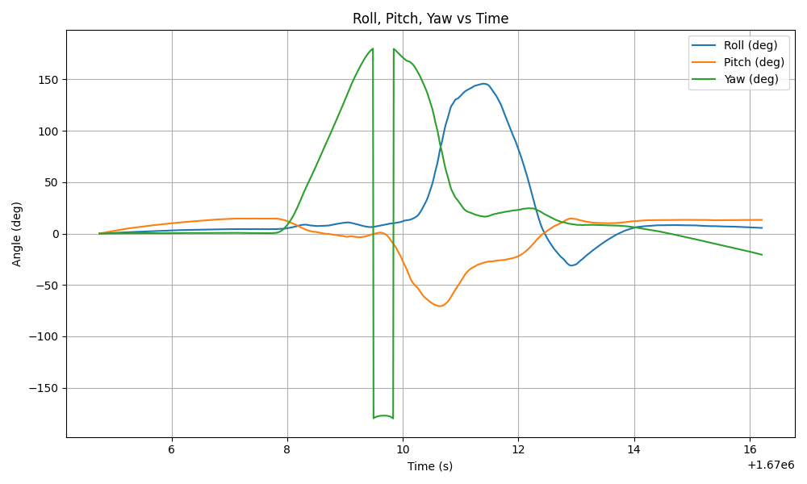
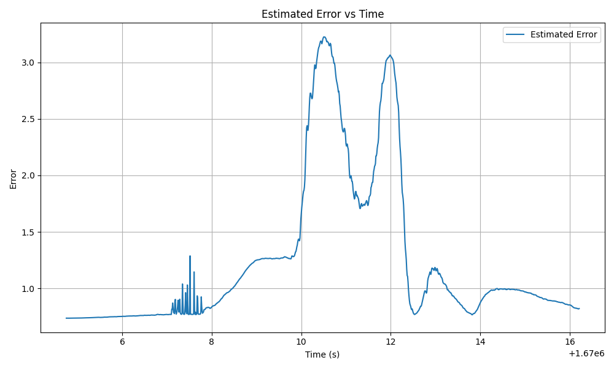
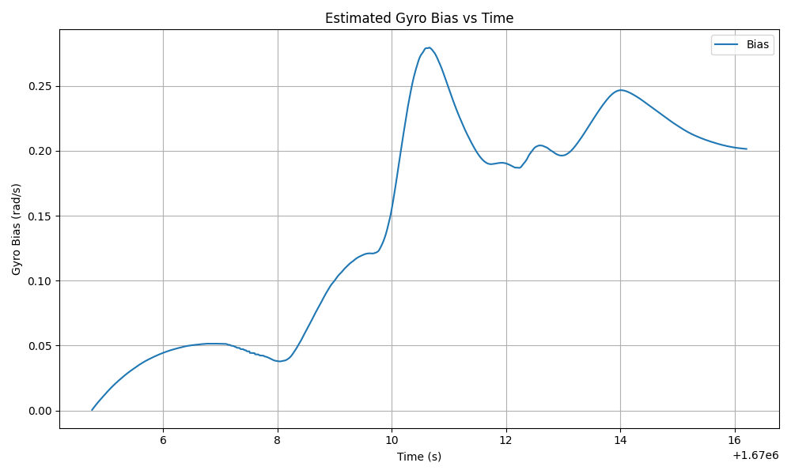

# Title

table of contents?
audience is staici and employers, so its ok to explain what mahony is
center all math equations? $$
## Introduction
In this project, we will be implementing three different orientation algorithms to estimate the orientation of a  phone over time. A naïve gyroscope integration (dead reckoning) algorithm is used in Question 1 and Question 4a. The Mahony filter is used in Questions 2 and 3, and serves as the baseline for comparison in Question 4. Finally, the TRIAD method is introduced in Question 4b and compared against the other methods in Questions 4c and 4d.

The framework of this codebase allows for the easy creation of different filters termed "estimators". In `filters.py` there is an abstract class called `Estimator` which can be extended to implement various filters and estimators. There are 5 implementations:
- Naïve Estimator (required) 
- Mahony Filter (required)
- TRIAD (Tri-Axial Attitude Determination) Estimator (required)
- Mahony with TRIAD filter (Caleb's idea)
- Hybrid Mahony-TRIAD filter (Charles' idea)

These subclasses of `Estimator` are then initialized and passed into the `simulate_and_visualize_data` method in `visualizer`. This project structure allows for the rapid creation and iteration of different filters. Additionally 3D visualization techniques along with 2D plots were used extensively in the debugging process. 

## Estimators

### Naïve Gyroscope Integration (Dead Reckoning)

The naïve gyroscope integration algorithm estimates orientation by directly integrating the angular velocity over time. It assumes that the gyroscope data is accurate and doesn't include any corrections from other sensors. This method is simple and fast but suffers from drift over time, especially if there's any bias or noise in the gyroscope. It works well in the short term but quickly becomes inaccurate during longer or more complex motion.

### Mahony Filter

The Mahony filter is a nonlinear complementary filter that combines gyroscope integration with landmark innovation using accelerometer and magnetometer data. It corrects drift and stabilizes orientation over time by aligning the estimated orientation with gravity (from the accelerometer) and magnetic north (from the magnetometer). It also dynamically estimates gyroscope bias. This makes the Mahony filter more reliable than dead reckoning, especially for longer durations or when precise orientation is important. It was observed during testing and debugging that the Mahony filter performs well when things are moving rapidly but suffers from drift and compounding error when things are still. 

### TRIAD Method

The TRIAD (Tri-Axial Attitude Determination) method estimates orientation using two reference vectors: gravity and magnetic north. It constructs two orthonormal frames — one from known inertial vectors and one from measured body-frame vectors — and computes the rotation matrix that aligns them. Unlike the other two methods, TRIAD is algebraic and doesn't rely on time integration, which means it gives an immediate estimate of orientation at each time step, but doesn’t track changes over time or handle gyroscope data.

### Caleb's Custom Filter
One of the main shortcomings (yet at the same time, its appeal) of the pure TRIAD method is its non-time dependence. That is, if you just provide the data at a single instant in time, I can provide you the rotation matrix. However this causes the estimator to be jumpy and skip all around when that is obviously not how real motion works. Caleb's filter attempts to solve this problem by using many aspects of the Mahony filter. The final result is the same as the Mahony filter, with the magnetic correction, quaternion update, and estimation of gravity and north vectors all being the same, but the innovation term `omega_mes` is calculated uniquely. A rotation matrix is created using the TRIAD function. 
We can use this matrix to write an equation:

$$\hat{R} = AR_{Tr}$$

 Where $\hat{R}$ is our current estimate of the rotation matrix, $R_{Tr}$ is the rotation matrix derived directly from data using the TRIAD method, and $A$ is an unknown rotation matrix relating the two. Solving this we get:
$$A = \hat{R}R_{Tr}^T$$

This rotation matrix $A$ can be thought of as the rotation from where TRIAD says we are to where all our previous estimations (a combination of TRIAD and Mahony stuff) says we are. Then we can turn this rotation $A$ into a angular velocity by representing it as an axis-angle and computing $\theta\hat{k}$. This innovation term is then multiplied by a gain and subtracted from the gyroscope data yielding: 
$$\omega_{mes}=\omega_{y} - k_{p}(\theta\hat{k})$$

This $\omega_{mes}$ is used just like it is in the Mahony filter. This filter succeeds at removing the jerkiness of the pure TRIAD estimator and shines where TRIAD is best, not drifting and remaining accurate for long periods of time.  However it falls short when things start moving fast. 

### Charles' Custom Filter
Charles' filter is a variant of Caleb's filter and combines the Mahony and Mahony-TRIAD filters into a hybrid. The goal is to use the best filter for the task at hand. TRIAD is used then things are relatively still and Mahony when there is movement. This is accomplished by computing the magnitude of the angular velocity data and comparing it to a predefined threshold like .1. If the value is greater than that, a plain Mahony filter is used but if its lower then the Modified Mahony Filter is used, utilizing the TRIAD method to compute the innovation as described above. This has good results and works as intended. 

It is important however to note that all these suppositions about the relative accuracy of different filters are dependent on our visualization code and subjective comparison of what we see in the visualization versus what we remember doing. There is a potential issue with initial conditions and differing coordinate systems in the visualizer which could significancy impact the results. This may be addressed, time allowing. 

## Question 1

In question 1 we implement a naïve gyroscope integration in order to estimate orientation with a set of given inputs. These inputs simulate perfect gyroscope data with no bias or drift.

The given inputs can be represented by various rotation matrixes.

1. $R_{x,\frac{\pi}{4}}$ -  Rotate about the **x-axis** by $\frac{\pi}{4}$ radians  
2. $R_{z,\frac{\pi}{4}}$ - Rotate about the **z-axis** by $\frac{\pi}{4}$ radians  
3. $R_{x,-\frac{\pi}{4}}$ - Rotate about the **x-axis** by $-\frac{\pi}{4}$ radians  
4. $R_{z,-\frac{\pi}{4}}$ - Rotate about the **z-axis** by $-\frac{\pi}{4}$ radians  

If we multiply all these rotation matrices we can see our expected result:

$R_{x,\frac{\pi}{4}} R_{z,\frac{\pi}{4}} R_{x,-\frac{\pi}{4}} R_{z,-\frac{\pi}{4}} = \begin{bmatrix}
0.8536 & 0.1464 & -0.5000 \\
-0.2500 & 0.9571 & -0.1464 \\
0.4571 & 0.2500 & 0.8536
\end{bmatrix}$

Which corresponds with this quaternion:

$q_{final}=0.9571 <  0.1036, -0.2500, -0.1036 >$

### Results

$q(1)=0.9571 <  0.1036, -0.2500, -0.1036 >$

We simulated this rotation over time and obtained the exact same final orientation as expected from the matrix multiplication. This verifies that our implementation of quaternion integration is correct. You can see a visualization of this rotation in Fig. 1.1 in the fig file under `fig\Fig 1-1.mp4`.

### Does it hold that $q(0) = q(1)$?

No, it does not hold that $q(0) = q(1)$. We can see from our results that:

$q(0)=1 <  0, 0, 0 >$

$q(1)=0.9571 <  0.1036, -0.2500, -0.1036 >$

This also makes conceptual sense because rotations in 3D space are not commutative.

## Question 2: Mahony Filter Implementation

In question 2 we implement a Mahony filter to estimate a phone's orientation over time with a given csv file containing gyroscope, accelerometer, and magnetometer data over time. The motion consists of a phone that is still for a few seconds, and is then picked up and rotated around randomly, but slowly and smoothly, and then set back down.

We tuned out K values to be the following based on trial and error.

$k_p=1, k_I=.3, k_a=.8, k_m=.2$

# FIXME update this visualization after getting all the different visualization tools in play, spesificly seeing the raw data and va and vm and vm hat and va hat and the gyrosope and bias and innovation and all that. 

We visualized this motion using MuJoCo that can be seen in `fig\Fig_2-2.mp4`

### Results

To calculate the rotation angle over time, we convert the estimated orientation quaternion at each time step into an axis-angle representation. We then extract the angle component and plot it with respect to time.

Figures 2-1a and 2-1b below show the rotation angle over time in radians and degrees, respectively. The phone remains still at the beginning, is then slowly rotated in multiple directions, and eventually returns to rest.

Over the course of the motion, the phone rotated a total of approximately 8,572 radians, or 491,165 degrees. This total includes all incremental rotations.

# FIXME update these after final check of code

.png)
*Fig 2-1a: Estimated rotation angle over time (radians)*

.png)
*Fig 2-1b: Estimated rotation angle over time (degrees)*

### Observations

While working on this project, we noticed several behaviors of the Mahony filter:

- When the magnetometer gain $k_m$ was set too high, the phone’s orientation estimate became overly constrained. Specifically, during large flips, the filter would only allow the phone to rotate about 90 degrees, even when the phone was flipped fully. This prevented full rotations and caused the phone to align too strongly with magnetic north.

- The filter showed a tendency to drift toward magnetic north very slowly. For low values of $k_m$, the phone would gradually oscillate around magnetic north until it converged on the correct orientation. For larger values of $k_m$, it would snap into place much more quickly. We discovered this when testing with our own data, where the phone was sitting still for a full minute, and we observed the filter slowly orienting it correctly over time. This behavior occurs because the initial orientation is assumed to be the identity quaternion, which does not match the phone's actual orientation. This led us to consider using the TRIAD method to initialize the orientation more accurately before switching to the Mahony filter for continuous updates.

- We verified the correctness of the internal orientation estimate using 3D visualization in MuJoCo. By observing the rotated magnetic reference vector $\hat{v}_m$, we saw that it remained fixed in the **spatial** (inertial) frame as expected. This confirmed that the estimated orientation was rotating the internal reference vectors correctly.

- To further test the filter's sensitivity, we placed a magnet near the phone. In the 3D visualization, we observed a clear reaction in the filter’s output — the orientation estimate became unstable or skewed. This confirmed that the magnetometer data was being used actively and was susceptible to external magnetic disturbances.

## Question 3

In Question 3, we used the Mahony filter developed in Question 2 to process IMU data collected from our own phone. We extracted gyroscope, accelerometer, and magnetometer data and exported it as a CSV file. The phone was able to sample data at approximately 100 Hz. While each sensor had its own timestamp, the sampling intervals were sufficiently close that we used the accelerometer timestamps as a common reference across all measurements.

We used `charlie_phone_540.csv` as the input dataset to the filter. In this dataset, the phone was rotated a total of 540 degrees: first 180° about the phone’s z-axis, then 180° about the y-axis, and finally 180° about the x-axis. A video showing the filter’s visualization of this sequence is included in `fig/Fig_3-1.mp4`.

### Results

#### (a) Roll, Pitch, Yaw vs. Time

We computed the roll, pitch, and yaw angles by converting the estimated orientation quaternion from the Mahony filter into Euler angles. These angles were then plotted with respect to time.

*Fig 3-2: Roll, Pitch, Yaw vs Time*

The plot confirms the intended motion sequence. Initially, we observe a rotation about the z-axis (yaw), followed by rotation about the y-axis (pitch), and finally about the x-axis (roll), consistent with the phone’s movement.

#### (b) Estimated Error vs. Time

To estimate the Mahony filter’s error signal, we used the formula given in Equation (6):

$$
E_{\text{mes}} = 1 - \mathbf{v}_a \cdot \hat{\mathbf{v}}_a + 1 - \mathbf{v}_m \cdot \hat{\mathbf{v}}_m
$$

This error metric captures the disagreement between the measured sensor directions and the expected directions from the current orientation estimate.

*Fig 3-3: Estimated Error vs Time*

The error peaks during periods of rapid motion, as expected. When the phone is still, the orientation estimate converges, and the error reduces.

#### (c) Gyroscope Bias Estimate vs. Time

The Mahony filter also maintains an internal estimate of the gyroscope bias, which is updated over time to account for sensor drift. We recorded and plotted this bias estimate.

  
*Fig 3-4: Estimated Gyroscope Bias vs Time*

The bias estimate increases during motion as expected.

## Question 4

### Results

